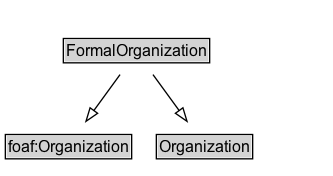

# FormalOrganization

## Diagram

=== "SVG (interactive)"

    <!-- Generated by graphviz version 14.0.2 (20251019.1705)
     -->
    <!-- Pages: 1 -->
    <svg width="249pt" height="132pt"
     viewBox="0.00 0.00 249.00 132.00" xmlns="http://www.w3.org/2000/svg" xmlns:xlink="http://www.w3.org/1999/xlink">
    <g id="graph0" class="graph" transform="scale(1 1) rotate(0) translate(4 128)">
    <polygon fill="white" stroke="none" points="-4,4 -4,-128 245.38,-128 245.38,4 -4,4"/>
    <g id="clust2" class="cluster">
    <title>cluster_associated</title>
    </g>
    <!-- FormalOrganization -->
    <g id="node1" class="node">
    <title>FormalOrganization</title>
    <g id="a_node1"><a xlink:href="../FormalOrganization" xlink:title="&lt;TABLE&gt;">
    <polygon fill="lightgray" stroke="none" points="44.5,-81.88 44.5,-98.12 152.25,-98.12 152.25,-81.88 44.5,-81.88"/>
    <text xml:space="preserve" text-anchor="start" x="45.5" y="-85.72" font-family="Arial" font-size="12.00">FormalOrganization</text>
    <polygon fill="none" stroke="black" points="43.5,-80.88 43.5,-99.12 153.25,-99.12 153.25,-80.88 43.5,-80.88"/>
    </a>
    </g>
    </g>
    <!-- foaf_Organization -->
    <g id="node3" class="node">
    <title>foaf_Organization</title>
    <g id="a_node3"><a xlink:href="https://w3id.org/citydata/imported/foaf/latest/Organization" xlink:title="&lt;TABLE&gt;">
    <polygon fill="lightgray" stroke="none" points="1,-9.88 1,-26.12 93.75,-26.12 93.75,-9.88 1,-9.88"/>
    <text xml:space="preserve" text-anchor="start" x="2" y="-13.72" font-family="Arial" font-size="12.00">foaf:Organization</text>
    <polygon fill="none" stroke="black" points="0,-8.88 0,-27.12 94.75,-27.12 94.75,-8.88 0,-8.88"/>
    </a>
    </g>
    </g>
    <!-- FormalOrganization&#45;&gt;foaf_Organization -->
    <g id="edge1" class="edge">
    <title>FormalOrganization&#45;&gt;foaf_Organization</title>
    <path fill="none" stroke="black" d="M86.03,-72.05C80.08,-63.89 72.81,-53.91 66.19,-44.82"/>
    <polygon fill="none" stroke="black" points="69.22,-43.03 60.5,-37.01 63.56,-47.16 69.22,-43.03"/>
    </g>
    <!-- Organization -->
    <g id="node4" class="node">
    <title>Organization</title>
    <g id="a_node4"><a xlink:href="../Organization" xlink:title="&lt;TABLE&gt;">
    <polygon fill="lightgray" stroke="none" points="114.25,-9.88 114.25,-26.12 184.5,-26.12 184.5,-9.88 114.25,-9.88"/>
    <text xml:space="preserve" text-anchor="start" x="115.25" y="-13.72" font-family="Arial" font-size="12.00">Organization</text>
    <polygon fill="none" stroke="black" points="113.25,-8.88 113.25,-27.12 185.5,-27.12 185.5,-8.88 113.25,-8.88"/>
    </a>
    </g>
    </g>
    <!-- FormalOrganization&#45;&gt;Organization -->
    <g id="edge2" class="edge">
    <title>FormalOrganization&#45;&gt;Organization</title>
    <path fill="none" stroke="black" d="M110.72,-72.05C116.67,-63.89 123.94,-53.91 130.56,-44.82"/>
    <polygon fill="none" stroke="black" points="133.19,-47.16 136.25,-37.01 127.53,-43.03 133.19,-47.16"/>
    </g>
    <!-- Invis -->
    </g>
    </svg>

=== "PNG"

    

## Specializations of FormalOrganization

| Class | Description |
|-------|-------------|
| [Business Entity (gr)](https://w3id.org/citydata/imported/gr/latest/BusinessEntity) |  |

## Formalization for FormalOrganization

| Property | Constraint |
|----------|------------|
| subClassOf | [Organization](Organization.md) |
| subClassOf | [foaf:Organization](foaf:Organization.md) |

