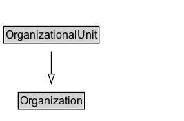

# OrganizationalUnit

## Diagram

=== "SVG (interactive)"

    <!-- Generated by graphviz version 14.0.2 (20251019.1705)
     -->
    <!-- Pages: 1 -->
    <svg width="200pt" height="132pt"
     viewBox="0.00 0.00 200.00 132.00" xmlns="http://www.w3.org/2000/svg" xmlns:xlink="http://www.w3.org/1999/xlink">
    <g id="graph0" class="graph" transform="scale(1 1) rotate(0) translate(4 128)">
    <polygon fill="white" stroke="none" points="-4,4 -4,-128 195.88,-128 195.88,4 -4,4"/>
    <g id="clust2" class="cluster">
    <title>cluster_associated</title>
    </g>
    <!-- OrganizationalUnit -->
    <g id="node1" class="node">
    <title>OrganizationalUnit</title>
    <g id="a_node1"><a xlink:href="../OrganizationalUnit" xlink:title="&lt;TABLE&gt;">
    <polygon fill="lightgray" stroke="none" points="1,-81.88 1,-98.12 102.75,-98.12 102.75,-81.88 1,-81.88"/>
    <text xml:space="preserve" text-anchor="start" x="2" y="-85.72" font-family="Arial" font-size="12.00">OrganizationalUnit</text>
    <polygon fill="none" stroke="black" points="0,-80.88 0,-99.12 103.75,-99.12 103.75,-80.88 0,-80.88"/>
    </a>
    </g>
    </g>
    <!-- Organization -->
    <g id="node3" class="node">
    <title>Organization</title>
    <g id="a_node3"><a xlink:href="../Organization" xlink:title="&lt;TABLE&gt;">
    <polygon fill="lightgray" stroke="none" points="16.75,-9.88 16.75,-26.12 87,-26.12 87,-9.88 16.75,-9.88"/>
    <text xml:space="preserve" text-anchor="start" x="17.75" y="-13.72" font-family="Arial" font-size="12.00">Organization</text>
    <polygon fill="none" stroke="black" points="15.75,-8.88 15.75,-27.12 88,-27.12 88,-8.88 15.75,-8.88"/>
    </a>
    </g>
    </g>
    <!-- OrganizationalUnit&#45;&gt;Organization -->
    <g id="edge1" class="edge">
    <title>OrganizationalUnit&#45;&gt;Organization</title>
    <path fill="none" stroke="black" d="M51.88,-72.05C51.88,-64.57 51.88,-55.58 51.88,-47.14"/>
    <polygon fill="none" stroke="black" points="55.38,-47.3 51.88,-37.3 48.38,-47.3 55.38,-47.3"/>
    </g>
    <!-- Invis -->
    </g>
    </svg>

=== "PNG"

    

## Formalization for OrganizationalUnit

| Property | Constraint |
|----------|------------|
| subClassOf | [Organization](Organization.md) |

